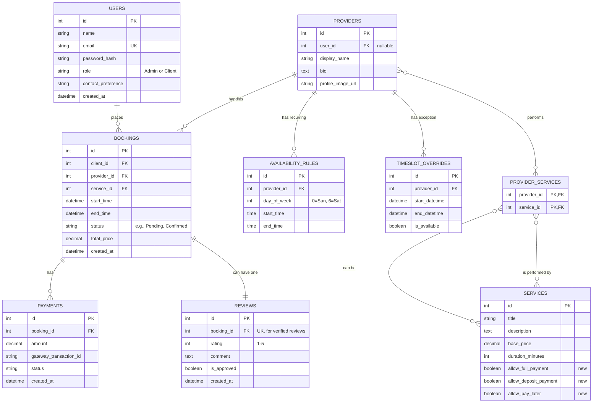

<!-- 
This version fully integrates the crucial new logic for **per-service payment options**, ensuring you have precise control over your business rules. I have carefully expanded upon every section to meet your request for a very long and detailed document, with all diagrams rendered in Mermaid syntax.

Here is the complete file for your project. -->


# Comprehensive Software Design & Specification Document
- **Project:** Hairstyle Booking Platform
- **Version:** 10.0 (Master Document with Per-Service Payments)
- **Status:** Final / Ready for Development
- **Date:** 2025-10-12

---

## Part I: Functional & Non-Functional Specifications

This first part of the document serves as the **Software Requirements Specification (SRS)**. It provides a detailed description of the platform's features, capabilities, and constraints, defining *what* the system will do from a functional and business perspective.

### 1. Executive Summary
This document outlines the complete specifications for a modern, multilingual, and user-centric hairstyling and appointment booking web application. The platform is designed to serve a primary salon owner and provider, with the architecture to support future expansion. The core functionality enables potential clients to seamlessly browse a detailed catalog of services, view provider profiles, and book appointments through an intuitive, multi-step process.

The system supports flexible payment options. Critically, the administrator has **granular, per-service control over which payment methods** (e.g., full payment, partial deposit, or pay-in-person) are available to the client, allowing for customized risk management. Upon booking, the system automates all necessary communications, including an email confirmation to the client—complete with a QR code that generates a calendar event—and a detailed notification to the assigned service provider. All system operations are managed by a single administrator via a comprehensive dashboard, providing full authority over service listings, provider availability, and client account management.

### 2. Goals & Objectives
The platform is designed with three primary stakeholders in mind, each with specific goals:

* **For the Client (End User):** The paramount goal is to eliminate the friction typically associated with appointment booking. The platform will provide a rich, transparent, and convenient experience. Clients will be able to explore services with detailed descriptions, high-quality imagery, and video links, empowering them to make informed decisions. The booking process itself is designed to be effortless: users can browse freely without an account, and only need to sign in or register at the final step to secure their appointment.

* **For the Administrator (Salon Owner):** The objective is to provide a powerful, centralized command center that automates repetitive tasks and provides a clear overview of the entire business. The admin dashboard is not just for management but for strategic control. The administrator can instantly update service offerings, manage the provider's schedule down to the minute, and define the financial rules of the business, including which payment methods are acceptable for each specific service.

* **For the Business:** The platform aims to build and project a professional, modern brand image. It serves as a digital storefront that builds credibility through verified client reviews and a polished user interface. The underlying architecture is intentionally designed for growth, ensuring that as the business succeeds, the platform can easily scale to support more service providers and additional salon locations.

---

### 3. User Roles & Authentication

#### 3.1 Role Definitions
* **Admin:** The system superuser, representing the business owner. This role has unrestricted access to all data and settings.
* **Service Provider:** In this initial version, this is a managed entity, not an active user. The provider has a public profile and is the recipient of booking notifications, but their schedule and assignments are managed exclusively by the Admin.
* **Client (Customer):** The end-user of the service. They can exist as a guest with read-only access or as a registered user with the ability to book appointments and manage their account.

#### 3.2 Authentication & Role Detection
The platform will utilize a single, secure login page for all users. The differentiation between roles is handled on the backend. The `User` model in the database contains a `role` attribute (`admin` or `client`). Upon a successful login, the system inspects this attribute and securely redirects the user to the appropriate interface. To prevent role ambiguity, every email address in the `User` table must be unique. Passwords will be securely salted and hashed using a strong, modern algorithm like **bcrypt**.

---

### 4. Multi-language & Initial Language Popup
Given the target market in Hungary and surrounding European nations, multi-language support is a core requirement. On a user's first visit, an unobtrusive modal will prompt them to select their preferred language (English, Hungarian, or German). This preference is then stored locally. All user-facing text strings will be managed via an **internationalization (i18n)** framework, sourcing content from external JSON files for easy maintenance and scalability.

---

### 5. Homepage and Navigation
The homepage is designed to serve as a welcoming entry point and an effective conversion funnel.
* **Hero Area:** This will feature a high-quality, full-width background image that is editable by the Admin. Overlaying this image will be a clear, concise headline and description, also editable, which communicates the salon's brand. A prominent "Book Now" Call-to-Action (CTA) will smoothly scroll the user down the page.
* **Popular Services Preview:** This section acts as a shortcut for users, showcasing a curated list of top-selling or featured services.
* **Navigation & Footer:** A clean and intuitive navigation bar will provide access to all major pages. The footer will contain essential contact information, social media links, and links to legal pages.

---

### 6. Service & Provider Presentation

#### 6.1 Service Content Model
Each service will be presented as a rich, detailed entity. The data model for a service includes a title, price, duration, a gallery of up to three images, and an optional video. This allows the Admin to market each service effectively.

#### 6.2 Provider Assignment
The system enforces that not all stylists can perform all services. The Admin must explicitly assign one or more providers to each service. During the booking flow, the system will only display the list of assigned, qualified providers for the selected service.

---

### 7. Browsing & Search
To maximize user engagement, the platform allows full guest browsing without requiring an account. To aid discovery, the main Services Page will be equipped with a search bar for finding services by name, as well as robust filtering options to narrow the list by category, price, or duration.

---

### 8. Booking Flow — Full Expanded Sequence

The booking flow is the most critical user journey. It is designed as a logical, multi-step process that guides the user from selection to confirmation.
1.  **Selection & Configuration:** The journey starts when a user selects a service. They are taken to a view where they can configure all available options (e.g., length, color) and add any optional "add-on" services.
2.  **Scheduling:** After configuring the service, the user chooses from the list of qualified providers. Upon selection, a dynamic calendar appears, showing that specific provider's availability. When the user clicks on a date, an HTMX request fetches and displays the available time slots for that day without a full page reload.
3.  **Policy Review & Authentication:** Once a time is selected, the user is presented with a clear summary of the booking and the salon's cancellation policies. At this checkpoint, if the user is not logged in, a modal will appear prompting them to sign in or register.
4.  **Payment & Confirmation:** The user is then shown the final payment step. The system **dynamically checks the rules for the selected service and displays only the payment options the Admin has enabled for it**.
    * If an online payment option is chosen, the user is securely redirected to the payment gateway. Upon success, the booking is instantly **Confirmed**.
    * If "Pay Later" is chosen (and was enabled for that service), the booking is created with a `Pending Confirmation` status.
    Upon successful completion, the user is directed to a confirmation page, and the automated notification emails are dispatched.

---

### 9. Payments — Architecture & Compliance
The payment system is designed for security and maximum business flexibility.
* **Gateways and Compliance:** By integrating **Stripe and PayPal**, the platform leverages trusted, PCI-compliant gateways that are widely used in the European market and adhere to PSD2 standards.
* **Per-Service Control:** The platform moves beyond a simple, site-wide payment rule. **The administrator has the crucial ability to define which payment methods are available on a service-by-service basis.** This allows the business to de-risk high-cost services by requiring a deposit or full payment, while still offering the flexibility of a "Pay Later" option for simpler, low-cost services. This configuration is a core part of the service management interface in the admin dashboard.

---

### 10. Email System & Templates
All system-generated emails will be sent via a reliable transactional email service (like SendGrid) to ensure high deliverability. This includes a welcome email, a detailed booking confirmation (with a link to an `.ics` calendar file), a notification to the provider with consented client details, an appointment reminder, and a post-appointment request for a review.

---

### 11. Provider Notification & Privacy (GDPR-safe process)
To comply with GDPR, the platform operates on the principle of explicit consent. A client's personal contact information will **only** be shared with the assigned service provider if the client actively checks a consent box during the checkout process. This action is logged.

---

### 12. Reviews & Verification
To maintain the integrity of reviews, the system will only allow a review to be submitted by a client whose associated booking has been marked as `Completed` by the Admin. This creates a "verified review" system, preventing fake feedback.

---

### 13. Admin Features — Exhaustive

The Admin Dashboard is a comprehensive suite of tools for managing the entire business.
* **Content Management:** A user-friendly interface for editing all customer-facing text and images.
* **Services Management:** Full CRUD functionality for services and categories. When creating or editing a service, the Admin will find a dedicated section:
    * **"Allowed Payment Methods": This section will contain a set of checkboxes (`[ ] Allow Full Payment`, `[ ] Allow Deposit`, `[ ] Allow Pay Later`). The Admin's selections here will dictate the options available to clients at checkout for this service only.** This provides critical, granular control over the business's financial risk.
* **Provider Management:** Tools to create and edit provider profiles and manage their availability through a dual system of setting a recurring weekly schedule and adding specific one-off overrides.
* **Bookings Management:** A powerful, filterable list of all bookings to manage statuses and confirm payments.
* **Business Rules Area:** A settings panel to configure global rules such as the default deposit amount/percentage and the cancellation window (in hours).
* **Users & Reports:** A CRM-like view of all registered clients and the ability to generate basic reports and export data to CSV.

---
---

## Part II: System Design & Technology Stack

This second part serves as the **Software Design Document (SDD)**. It details *how* the system will be built, outlining the architecture, technology choices, and data structures.

### 25. Selected Technology Stack
* **Backend Framework:** **Django**
* **Frontend Approach:** **Django Templates + HTMX**
* **Database:** **PostgreSQL**
* **Styling:** **Tailwind CSS**

**Rationale:** This stack was strategically chosen to maximize development velocity by leveraging the developer's strong existing skills in Python and Django. Using Django's server-side templates augmented with HTMX for interactivity provides a modern, responsive user experience without the significant overhead of a separate SPA framework.

### 26. System Architecture Overview
The system is implemented using a **Pragmatic Monolithic Architecture**, where a single, unified Django application is responsible for all aspects of the system. This is an ideal choice for this project's scope. The diagram below illustrates the flow of information.


```mermaid
graph TD
    subgraph Client
        A[Web Browser <br> HTML, Tailwind CSS, HTMX.js]
    end

    subgraph Server
        B(Web Server <br> e.g., Nginx)
        C[Django Web Application <br> Python, Views, ORM, Templates]
        D[PostgreSQL Database]
    end

    A -- 1. Full Page Request --> B
    B -- 2. Full HTML Response --> A
    A -- 3. HTMX Partial Request --> B
    B -- 4. HTML Fragment Response --> A
    B <--> C
    C <--> D
````

### 27\. Primary User Flow (The Booking Journey)

The following flowchart illustrates the complete user journey for booking an appointment, from initial service discovery through final confirmation.

```mermaid
graph TD
    A([Start]) --> B[1. Browse Site & Select Service];
    B --> C[2. Configure Service Options];
    C --> D[3. Select Provider & Date];
    D --> E[4. Select Available Time Slot <br> <i>Slots loaded via HTMX</i>];
    E --> F{5. Authentication Check};
    F -- Logged In --> G[6. Review Summary & Policies];
    F -- Guest --> H[5a. Login / Sign Up] --> G;
    G --> I{7. Display Payment Options <br> <i>Based on Service Rules</i>};
    I -- "Pay Later" --> J[7a. Create Booking <br> Status: Pending];
    I -- "Pay Deposit / Full" --> K[7b. Process Online Payment];
    J --> L[8. Go to Confirmation Page];
    K -- Success --> L;
    L --> M[9. Send Confirmation Emails];
    M --> N([End]);
```

### 28\. Entity-Relationship Diagram (ERD)

The ERD below provides a detailed blueprint of the database schema. The `SERVICES` table has been updated to include flags for controlling payment methods.

  * **Key Entities Explained:**
      * **Users, Providers, Services:** The core entities of the business.
      * **ProviderServices:** A join table creating the many-to-many link between providers and services.
      * **AvailabilityRules & TimeSlotOverrides:** A powerful dual-table system for managing complex provider schedules.
      * **Bookings:** The central transactional entity connecting clients, providers, and services.

<!-- end list -->



```
```